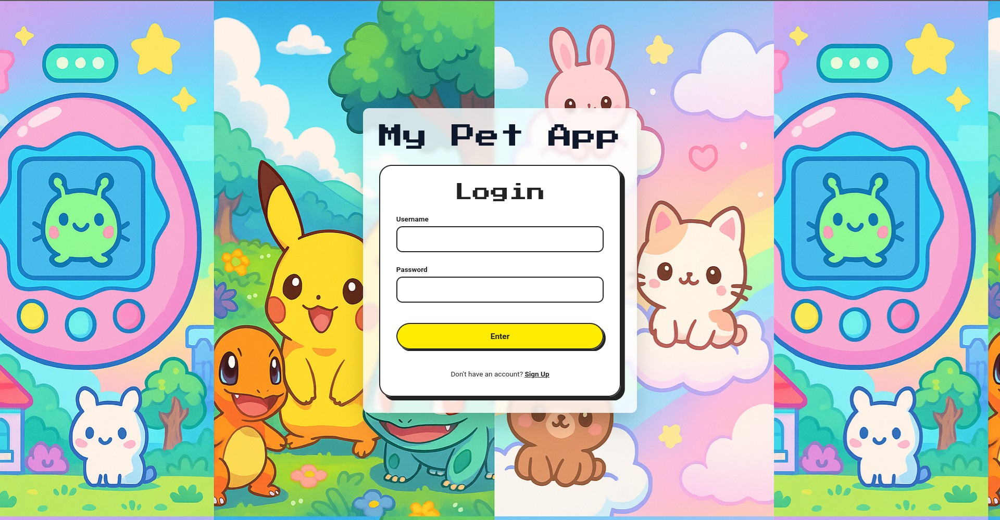
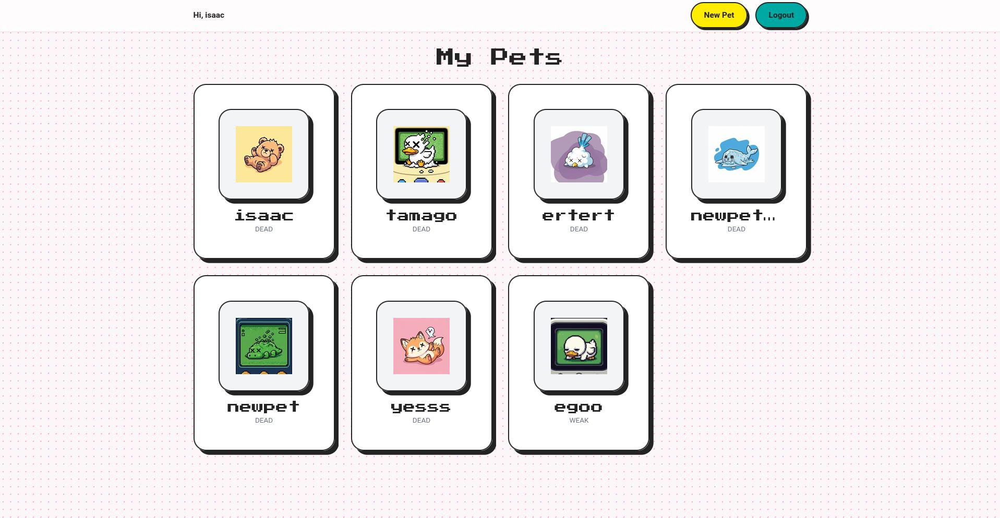
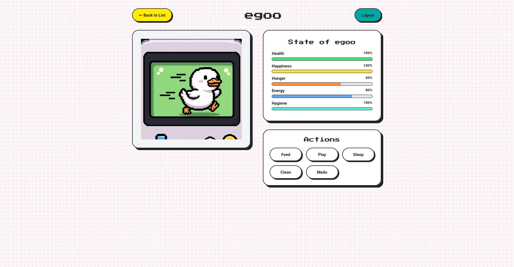
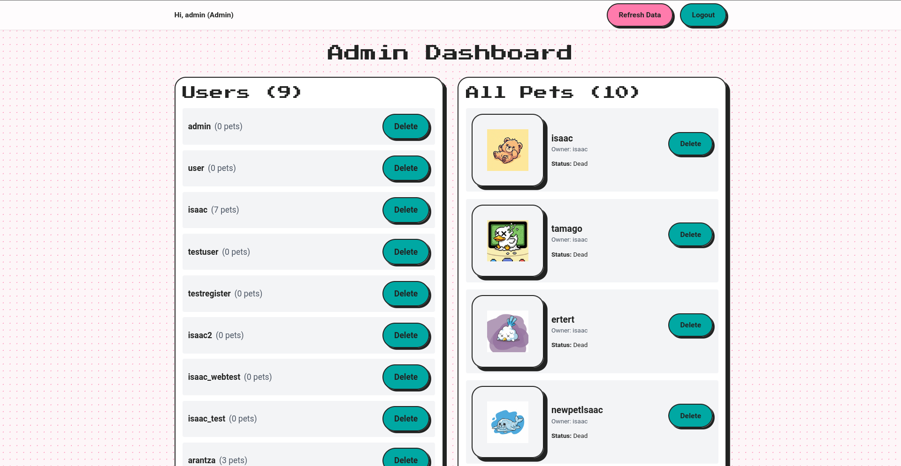

# Digital Pet UI (Frontend)

This is the fronten for the Digital Pet application, a dynamic and responsive Single-Page Application (SPA) built with React. It provides a user-friendly interface to interact with the backend API, manage virtual pets, and access administrative features.

## Tech Stack & Key Libraries

-   **Framework**: React
-   **Routing**: `react-router-dom` for handling all client-side navigation and protected routes.
-   **HTTP Client**: `axios` for making clear and concise API calls to the Spring Boot backend.
-   **Styling**: Tailwind CSS for a modern, utility-first approach to responsive design.
-   **State Management**: React Context API (`AuthContext`) for managing global application state, such as user authentication and session tokens.

## Key Features

-   **Full-Stack Authentication**: Secure login and registration forms that communicate with the backend to obtain a JWT, which is then stored and used for all protected API calls.

-   **Role-Based Access Control (RBAC)**: The application features a robust routing system that directs users to different experiences based on their role:
    -   **Users** are sent to their pet list (`/pets`).
    -   **Admins** are sent to a comprehensive admin dashboard (`/admin`).

-   **Dynamic Pet Interaction**:
    -   **Pet List Page**: Users can see a gallery of all their pets, with key stats and state-aware images.
    -   **Pet Detail Page**: A dedicated page for each pet showing detailed stats and providing action buttons (`Feed`, `Play`, `Clean`, `Give Medicine`).
    -   **State-Aware UI**: The interface provides clear visual feedback. Action buttons are disabled and pet cards are grayed out if a pet's `evolutionState` is `DEAD`.

-   **Comprehensive Admin Dashboard**:
    -   A private, admin-only view that lists all users and all pets in the entire system.
    -   Functionality to manage the application, including deleting users and pets directly from the dashboard.
    -   Calculated views, such as displaying the number of pets each user owns.

-   **Modern UI/UX**:
    -   A consistent and reusable component-based architecture (`PetCard`, `PetImage`, `PetActions`, `AuthLayout`).
    * A visually appealing login/register screen with a full-screen background image and a readable, blurred form container.
    -   Sticky navigation bars for easy access to primary actions like creating a new pet or logging out.

## Project Structure

The frontend codebase is organized for clarity and scalability:

-   `src/pages`: Contains the top-level components for each distinct page or view in the application (e.g., `LoginPage.jsx`, `AdminPage.jsx`, `PetListPage.jsx`).
-   `src/components`: Holds reusable UI components, organized into subdirectories by feature.
    -   `auth/`: Components related to authentication, like `AuthForm.jsx`.
    -   `pets/`: Components for displaying pet information, like `PetCard.jsx`, `PetImage.jsx`, and `PetActions.jsx`.
    -   `layout/`: Components that define the overall page structure, like `AuthLayout.jsx`.
    -   `common/`: Shared components like `ProtectedRoute.jsx`.
-   `src/context`: Home to React Context providers for managing global state across the application, most importantly `AuthContext.jsx`.
-   `src/api`: Contains the configured `axios` instance (`apiClient.js`), which centralizes the base URL and handles API requests.

## Screenshots

Here are some representative views of the application:

**Login Screen with Blurred Background**
( "Login page with a full-screen background image and a centered, readable form.")

**User's Pet List Page**
 "A grid view showing a user's collection of pets, with state-aware images and basic info.")

**Pet Detail Page with Actions**
 "A detailed view of a single pet, showing its image, stats, and a list of action buttons.")

**Admin Dashboard**
 "The admin-only view showing lists of all users and all pets in the system, with management options.")


## Setup and Installation

1.  Navigate to the frontend project directory.
2.  Install the necessary dependencies:
    ```sh
    npm install
    ```
3.  Ensure the backend API server is running (usually on `localhost:8080`). The frontend is configured in `src/api/apiClient.js` to connect to this address.
4.  Start the frontend development server:
    ```sh
    npm run dev
    ```
5.  The application will be available at `http://localhost:5173` (or another port if specified).